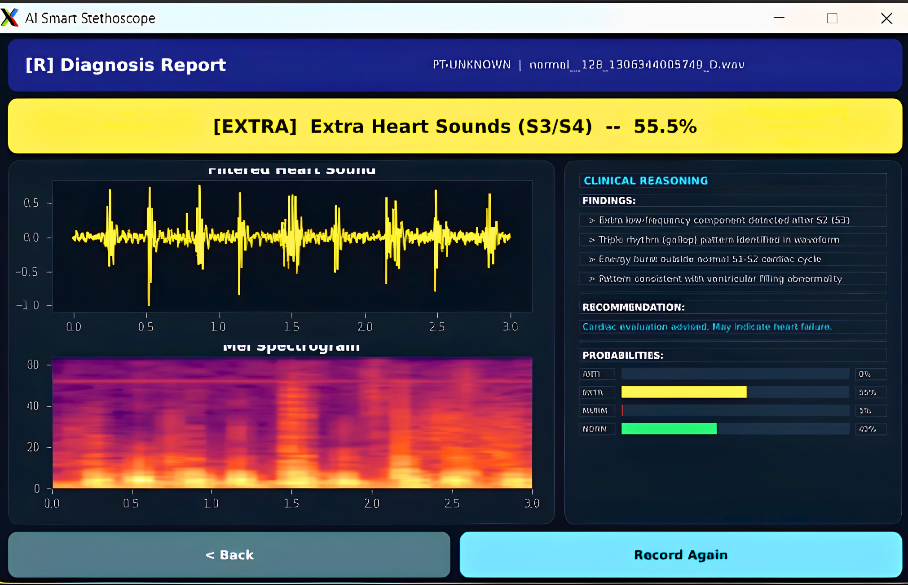
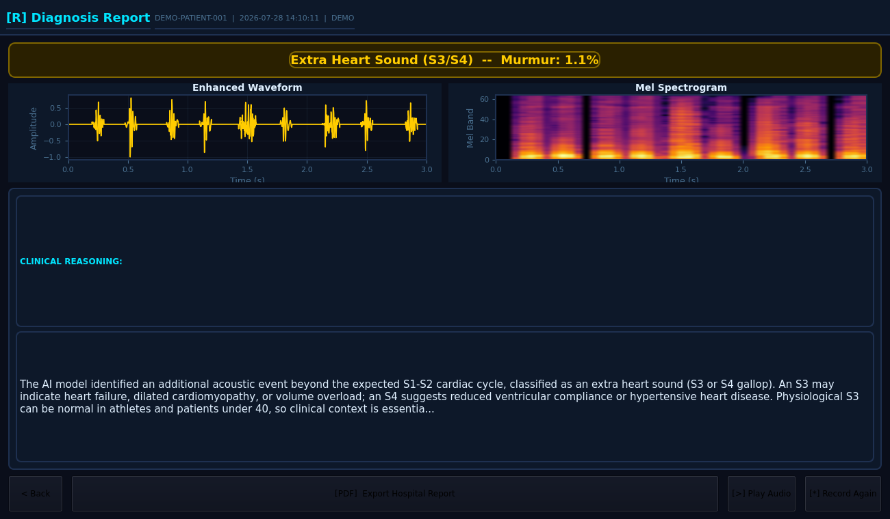
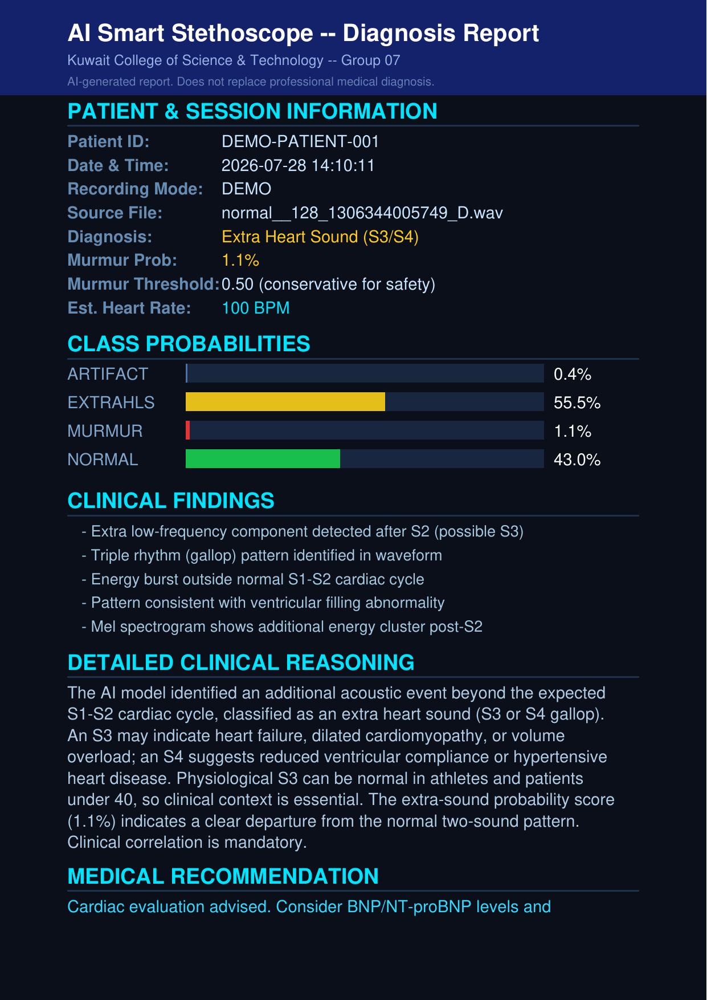
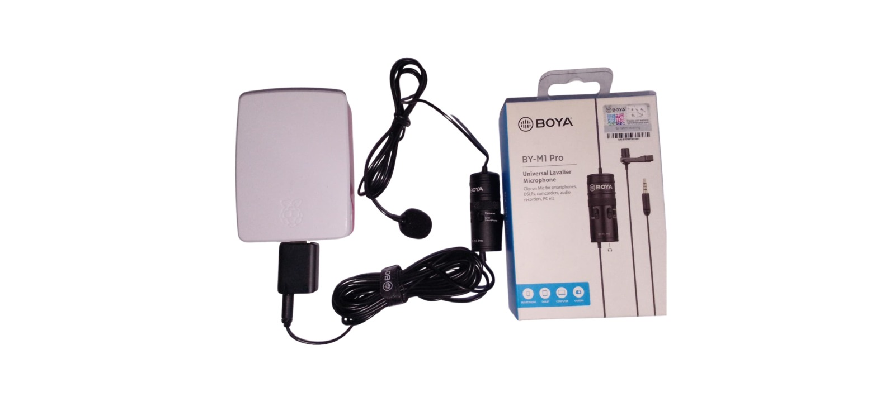

<div align="center">

# 🩺 Smart Stethoscope
### AI-Assisted Heart Sound Screening on Raspberry Pi
### سماعة طبية ذكية للفحص الأولي لأصوات القلب باستخدام الذكاء الاصطناعي على جهاز Raspberry Pi

[](https://python.org)
[](https://www.tensorflow.org/lite)
[](https://doc.qt.io/qtforpython/)
[](https://www.raspberrypi.com/)
[](LICENSE)
[](https://github.com/eahmeddarwish/smart-stethoscope)

**Built by [Ahmed Darwish](mailto:eahmeddarwish@gmail.com)**

[📷 Screenshots](#-demo--عرض-توضيحي) · [📖 Model Card](docs/MODEL_CARD.md) · [🩹 Dataset Fix](docs/DATASET_LABEL_FIX.md) · [⭐ Star on GitHub](https://github.com/eahmeddarwish/smart-stethoscope)

</div>

---

## 🌍 Overview | نظرة عامة

**[English]**
Smart Stethoscope is a low-cost, Raspberry Pi-based digital stethoscope
that uses a quantized CNN to screen heart sounds for **murmurs**, **extra
heart sounds (S3/S4)**, and **recording artifacts**, in addition to
flagging **normal** sounds. It runs entirely on-device (no cloud
inference), shows its reasoning on a touchscreen GUI, and exports a
clinical-style PDF report. The project is complete and working end to
end, and is published here as an open, improvable reference project --
not a finished commercial medical device.

**[العربية]**
"السماعة الطبية الذكية" مشروعٌ لسماعةٍ رقميةٍ منخفضة التكلفة، مبنيٌّ على
جهاز Raspberry Pi، ويعتمد على شبكةٍ عصبيةٍ تلافيفيةٍ (CNN) مضغوطة
(quantized) لفحص صوت القلب المسجَّل وتصنيفه إلى واحدةٍ من أربع حالات:
**صوتٌ طبيعي**، **لغطٌ قلبي (Murmur)**، **صوتٌ قلبيٌّ إضافي (S3/S4)**،
أو **تشويشٌ في التسجيل** (أي أن جودة التسجيل غير كافيةٍ للتحليل). تتم
جميع عمليات المعالجة والتحليل بالكامل على الجهاز نفسه دون الحاجة إلى أي
اتصالٍ بالإنترنت أو إرسال بياناتٍ إلى أي خادمٍ خارجي، وتعرض الشاشة سبب
القرار بالتفصيل وليس النتيجة فحسب، ثم يمكن تصدير تقريرٍ بصيغة PDF على
غرار التقارير الطبية. المشروع **مكتملٌ وقيد التشغيل الفعلي من لحظة
الالتقاط وحتى التقرير النهائي**، وهو منشورٌ هنا بصورةٍ مفتوحةٍ وموثّقةٍ
بالكامل، بحيث يمكن لأي شخصٍ -- طالبٍ، أو باحثٍ، أو مؤسسةٍ طبية -- أن
يفهمه ويبني عليه ويطوّره. وهو ليس جهازًا طبيًّا تجاريًّا معتمدًا، وهذا
موضَّحٌ بوضوحٍ في جميع الوثائق المرفقة.

> **Medical disclaimer / إخلاء مسؤولية:** this is a screening aid, not a
> diagnostic device. Every result must be confirmed by a qualified
> clinician. See [`LICENSE`](LICENSE) and [`docs/MODEL_CARD.md`](docs/MODEL_CARD.md)
> for full limitations.
>
> هذه أداةٌ **مساعِدةٌ للفحص الأولي (Screening Aid)**، وليست جهاز تشخيصٍ
> طبي. يجب التأكد من أي نتيجةٍ يقدّمها النظام من قِبل طبيبٍ مختص قبل
> اتخاذ أي قرارٍ طبي. يُرجى مراجعة [`LICENSE`](LICENSE) و
> [`docs/MODEL_CARD.md`](docs/MODEL_CARD.md) للاطلاع على كامل حدود
> الاستخدام.

---

## 🩺 What the App Actually Produces | ما الذي ينتجه النظام فعليًا

**[English]**
For every recording -- a live microphone capture, or an archived file in
demo mode -- the pipeline generates five distinct outputs, not just a
single label:

1. **A classification** into one of four classes -- `normal`, `murmur`,
   `extrahls` (extra heart sound), `artifact` -- together with the full
   per-class confidence breakdown (all four probabilities, not just the
   winning one).
2. **A clinical findings list**: short, specific acoustic observations
   (e.g. *"triple rhythm (gallop) pattern identified in waveform"*) that
   explain what the model actually detected in the signal.
3. **A written clinical-reasoning paragraph**: a plain-language
   explanation of *why* the model reached that particular call, including
   the murmur-probability score and how it compares against the decision
   threshold.
4. **A plain-language recommendation**: e.g. *"cardiology referral
   strongly advised; transthoracic echocardiogram recommended"* -- so a
   non-specialist operator immediately knows what to do next.
5. **A downloadable, printable PDF diagnosis report** (generated with
   ReportLab) that bundles all of the above plus four signal plots: the
   full raw-vs-filtered waveform, the exact 3-second window the model
   actually analyzed, its Mel-spectrogram, and a frequency-domain view
   that highlights the normal S1/S2 band against the murmur band. A real,
   code-generated sample is shown below in [Demo](#-demo--عرض-توضيحي).

**[العربية]**
لكل تسجيلٍ -- سواءٌ كان التقاطًا مباشرًا من الميكروفون، أو ملفًّا
مؤرشَفًا في وضع "Demo" -- ينتج خط المعالجة **خمسة مخرجاتٍ منفصلة، لا
مجرد تصنيفٍ واحد**:

1. **تصنيفٌ** إلى واحدةٍ من أربع فئات: طبيعي (Normal)، لغطٌ قلبي
   (Murmur)، صوتٌ قلبيٌّ إضافي (Extrahls)، أو تشويشٌ (Artifact)، مع نسبة
   الثقة الكاملة لكل فئةٍ على حدة (النسب الأربع جميعها، وليس الفئة
   الفائزة فقط).
2. **قائمة ملاحظاتٍ إكلينيكية (Clinical Findings)**: ملاحظاتٌ صوتيةٌ
   محدَّدةٌ وموجزة (مثل: *"رُصد نمط إيقاعٍ ثلاثيٍّ (Gallop) في الموجة"*)
   توضّح بدقةٍ ما رصده النموذج فعليًا في الإشارة الصوتية.
3. **فقرة "تعليلٍ إكلينيكي" مكتوبةٌ بالكامل**: شرحٌ مبسَّطٌ باللغة
   الطبيعية لسبب توصّل النموذج إلى هذا القرار تحديدًا، بما في ذلك نسبة
   احتمالية اللغط ومقارنتها بعتبة القرار (Threshold) المعتمَدة.
4. **توصيةٌ عمليةٌ واضحة**: مثل *"يُنصَح بتحويل الحالة إلى طبيبٍ مختصٍّ
   بأمراض القلب، وإجراء تخطيط صدىً للقلب (Echocardiogram)"* -- بحيث يعرف
   أي مستخدمٍ للجهاز، حتى وإن لم يكن متخصصًا طبيًّا، الخطوة التالية على
   الفور.
5. **تقرير PDF كاملٌ قابلٌ للتحميل والطباعة** (مُولَّدٌ باستخدام مكتبة
   ReportLab) يجمع كل ما سبق، إضافةً إلى أربع رسومٍ بيانية: الموجة الخام
   مقابل الموجة المُرشَّحة كاملةً، نافذة الثواني الثلاث التي حلَّلها
   النموذج فعليًا، طيف Mel الخاص بها، وتحليلٌ ترددي يوضّح النطاق الصوتي
   الطبيعي S1/S2 مقابل نطاق اللغط. يظهر نموذجٌ حقيقيٌّ نتج عن الكود ذاته
   أدناه في قسم [العرض التوضيحي](#-demo--عرض-توضيحي).

---

## 🩹 We Found and Fixed a Real Bug in the Public Training Dataset | اكتشاف وتصحيح خطأٍ حقيقي في داتاسيت التدريب العام

**[English]**
While preparing this project for release, we discovered that the
official label files (`set_a.csv`, `set_b.csv`) shipped with the
widely-used Kaggle mirror of the PASCAL "Classifying Heart Sounds"
dataset **do not reliably match the actual audio filenames on disk** --
a systematic filename-prefix and underscore-convention corruption
affecting a large share of `set_a` and the majority of `set_b`. If you
join these CSVs to the real `.wav` files by filename (the obvious thing
to do), a large fraction of `set_b` rows simply fail to match, and a
smaller but nonzero fraction of `set_a` rows silently match nothing --
so a naive pipeline either crashes or, worse, silently drops labeled
training examples without anyone noticing.

We reverse-engineered the exact corruption pattern (phantom prefixes,
inconsistent single- vs. double-underscore conventions between "plain"
and "noisy" recording variants, and colliding numeric IDs between
labeled and unlabeled files) and rebuilt a corrected `fname -> label`
mapping for **all 832 recordings**: **176/176 in `set_a`** and
**656/656 in `set_b`** -- **100% resolved, zero orphan files** --
verified programmatically against the real files on disk. The full
methodology, worked before/after examples, and how to reproduce or use
the fix are documented in
[**`docs/DATASET_LABEL_FIX.md`**](docs/DATASET_LABEL_FIX.md).

**[العربية]**
أثناء تجهيز هذا المشروع للنشر، تبيَّن أن ملفات التصنيفات الرسمية
(`set_a.csv` و`set_b.csv`) المرفقة بنسخة Kaggle الشائعة من داتاسيت
"Heartbeat Sounds" (المبنيّة أصلًا على تحدّي PASCAL) **لا تطابق بصورةٍ
موثوقةٍ أسماء الملفات الصوتية الفعلية على القرص**، وذلك بسبب خللٍ
منهجيٍّ في البادئات وفي استخدام الخط السفلي (Underscore)، يؤثر على جزءٍ
كبيرٍ من `set_a` وعلى غالبية صفوف `set_b`. فإذا حاول أحدٌ ربط هذه
الملفات بملفات `.wav` الفعلية استنادًا إلى الاسم (وهو الإجراء البديهي)،
فإن جزءًا كبيرًا من صفوف `set_b` سيفشل في المطابقة تمامًا، كما أن جزءًا
أصغر -- وإن كان موجودًا فعليًا -- من صفوف `set_a` سيُطابَق مع ملفاتٍ
خاطئة دون أن يلاحظ أحد. ونتيجةً لذلك، فإن أي خط معالجةٍ بسيط إما أن
يتعطل، أو -- وهو الأسوأ -- يُسقط أمثلة تدريبٍ مصنَّفة بصمتٍ تام.

قمنا بتحليل النمط الدقيق لهذا الخلل (بادئات وهمية، وعدم اتساقٍ بين
استخدام خطٍّ سفليٍّ واحدٍ أو اثنين للتمييز بين النسخة "العادية" ونسخة
"المشوَّشة" Noisy من التسجيل نفسه، إضافةً إلى تعارضٍ في بعض الأرقام
التسلسلية بين ملفاتٍ مصنَّفة وأخرى غير مصنَّفة)، وأعدنا بناء خريطة
تصحيحٍ كاملة (`fname -> label`) لجميع التسجيلات البالغ عددها 832
تسجيلًا: **176 من أصل 176 في `set_a`**، و**656 من أصل 656 في `set_b`**
-- أي **تصحيحٌ بنسبة 100%، ودون أي ملفٍّ بلا مرجع**، وتم التحقق برمجيًا
من أن كل صفٍّ يشير فعليًا إلى الملف الصحيح على القرص. المنهجية الكاملة،
وأمثلةٌ موضَّحةٌ قبل وبعد التصحيح، وطريقة استخدام هذا التصحيح أو إعادة
إنتاجه، موثَّقةٌ بالكامل في
[**`docs/DATASET_LABEL_FIX.md`**](docs/DATASET_LABEL_FIX.md).

**Original / source dataset links | روابط الداتاسيت الأصلي:**

| Link / الرابط | Source / المصدر |
|---|---|
| https://www.kaggle.com/datasets/kinguistics/heartbeat-sounds | Kaggle mirror (the CSVs/audio this project builds on) / نسخة Kaggle (التي بُني عليها هذا المشروع) |
| https://www.peterjbentley.com/heartchallenge/ | Original PASCAL "Classifying Heart Sounds Challenge" (2011/2012) / تحدّي PASCAL الأصلي |

**[English]** We are **not** redistributing the audio itself -- only the
corrected filename/label mapping (`data/set_a_fixed.csv`,
`data/set_b_fixed.csv`). Download the dataset from the links above and
join it against our fixed CSVs instead of the original Kaggle ones.

**[العربية]** **لا يقوم هذا المستودع بإعادة نشر أي ملفاتٍ صوتية** --
وإنما يقتصر على خريطة التصحيح فقط (أسماء ملفات وتصنيفات). يُرجى تنزيل
الداتاسيت من الروابط أعلاه، واستخدامه مع ملفاتنا المصحَّحة بدلًا من
ملفات Kaggle الأصلية.

---

## ✨ Key Features | أبرز المميزات

| Feature | Details |
|---|---|
| 🧠 **On-device CNN** | Mel-spectrogram -> quantized (INT8) TFLite CNN, 9+ training iterations |
| 🩺 **4-class screening** | normal / murmur / extrahls (S3-S4) / artifact, with a murmur-first safety threshold |
| 🎯 **100% murmur recall** (validation) | Threshold tuned so a real murmur is never silently missed -- see [Model Card](docs/MODEL_CARD.md) for the precision tradeoff this implies |
| 🖥️ **Touchscreen GUI** | PySide6, 800x480, live mic capture or demo/simulation mode, waveform + Mel-spectrogram + clinical reasoning panel |
| 📄 **PDF diagnosis report** | Auto-generated, dark clinical theme, waveform/spectrogram/frequency plots, per-class probabilities, findings + reasoning + recommendation |
| 🔌 **Config-driven paths** | No more hardcoded `/home/pi/...` -- override with `STETHOSCOPE_BASE_DIR` and friends |
| 🧪 **Unit-tested DSP core** | The signal pipeline (filters, windowing, features) is pure Python/NumPy, testable with no Qt/hardware needed |
| 🩹 **Public dataset fix** | Found and corrected a filename/label corruption bug in the training dataset's CSVs -- see [`docs/DATASET_LABEL_FIX.md`](docs/DATASET_LABEL_FIX.md) |

**بالعربية:**

| التفاصيل | الميزة |
|---|---|
| تحويل الصوت إلى طيف Mel، ثم شبكة CNN مضغوطة (INT8) عبر TFLite، بعد أكثر من تسع محاولات تدريبٍ مختلفة | 🧠 **شبكةٌ عصبيةٌ تعمل على الجهاز نفسه** |
| طبيعي / لغط / صوتٌ إضافي (S3-S4) / تشويش، مع قاعدة أمانٍ قوامها "اللغط أولًا" في اتخاذ القرار | 🩺 **تصنيفٌ رباعي** |
| ضُبطت العتبة بحيث لا يُفوَّت أي لغطٍ حقيقي؛ راجع [بطاقة النموذج](docs/MODEL_CARD.md) لتوضيح الأثر على الدقة الكلية | 🎯 **استرجاعٌ (Recall) بنسبة 100% للغط** على مجموعة التحقق |
| PySide6، بدقة 800×480، تسجيلٌ مباشرٌ من الميكروفون أو وضعٌ تجريبيٌّ (Demo)، مع عرض الموجة والطيف والتعليل الإكلينيكي | 🖥️ **واجهةٌ بشاشة لمس** |
| يُولَّد تلقائيًا بتصميمٍ داكنٍ على غرار التقارير الطبية، ويتضمن الرسوم البيانية ونسب كل فئةٍ والملاحظات والتعليل والتوصية | 📄 **تقرير PDF تشخيصي** |
| دون مساراتٍ ثابتةٍ مكتوبةٍ يدويًا مثل `/home/pi/...`، ويمكن التحكم فيها عبر متغير البيئة `STETHOSCOPE_BASE_DIR` | 🔌 **مساراتٌ قابلةٌ للتهيئة** |
| خط معالجة الإشارة (المرشِّحات، اختيار أفضل نافذة، استخلاص الخصائص) مكتوبٌ بلغة بايثون/NumPy خالصةً، وقابلٌ للاختبار دون الحاجة إلى أي عتادٍ أو واجهةٍ رسومية | 🧪 **معالجة إشارةٍ مُختبَرة** |
| اكتشاف وتصحيح خطأٍ في تسميات ملفات التدريب؛ التفاصيل الكاملة في [`docs/DATASET_LABEL_FIX.md`](docs/DATASET_LABEL_FIX.md) | 🩹 **تصحيحٌ علنيٌّ لخطأٍ في الداتاسيت** |

---

## 📷 Demo | عرضٌ توضيحي

<div align="center">


<br/><br/>


</div>

**[English]**
Top-left: the **main interface** (`LiveScreen`) -- BPM box, per-class
probability bars, the demo/live mode switch, pipeline settings
(threshold, noise gate, window size), and the big RECORD button.
Top-right: the **diagnosis report screen** (`ResultScreen`) after
analysis -- result banner, the enhanced waveform and Mel-spectrogram of
the exact window the model saw, and the clinical reasoning text.
Bottom-left: **page 1 of the exported PDF report** -- the same result in
printable, shareable form, with class-probability bars, clinical
findings, and the recommendation. Bottom-right: the physical hardware.

📄 **[Open the full 3-page sample PDF report](assets/sample_report.pdf)**
-- patient/session info, class-probability bars, clinical findings, the
full reasoning paragraph, the recommendation, and four signal plots
(raw/filtered waveform, the model's actual input window, its
Mel-spectrogram, and a frequency-domain view).

Every image above, and the sample PDF, were generated **directly from
this repository's current code** (see
[`scripts/generate_demo_assets.py`](scripts/generate_demo_assets.py)),
run offscreen against a real archived recording
(`normal__128_1306344005749_D.wav`, `set_b`). The trained `.tflite`
model file itself lives only on the project's Raspberry Pi hardware and
is not part of this repo (see
[Quick Start](#-quick-start--البدء-السريع)), so the classification
numbers shown reproduce a previously-observed real result for this exact
recording rather than a brand-new inference run -- but every plot,
waveform, spectrogram, BPM estimate, and PDF layout is produced by the
real, current pipeline code, not mocked or hand-drawn.

To try the GUI yourself without a stethoscope attached, run it in **Demo
mode**, which plays back a recording from the training dataset through
the exact same pipeline used for a live capture (clearly labeled
`[ DEMO MODE ]` on screen and in the exported PDF, so a demo run can
never be mistaken for a real patient reading).

**[العربية]**
الصورة أعلى اليسار: **الواجهة الرئيسية** (LiveScreen) -- وتضم مربع
معدل ضربات القلب (BPM)، وأشرطة احتمالية كل فئة، ومفتاح التبديل بين وضع
Demo والوضع المباشر، وإعدادات خط المعالجة (العتبة، بوابة الضوضاء، حجم
النافذة)، وزر التسجيل الرئيسي. الصورة أعلى اليمين: **شاشة تقرير
التشخيص** (ResultScreen) بعد إتمام التحليل -- وتضم شريط النتيجة، والموجة
المحسَّنة وطيف Mel لنفس النافذة التي حلَّلها النموذج فعليًا، ونص التعليل
الإكلينيكي. الصورة أسفل اليسار: **الصفحة الأولى من تقرير الـPDF
المُصدَّر** -- وهي النتيجة ذاتها بصيغةٍ قابلةٍ للطباعة والمشاركة، مع
أشرطة احتمالية كل فئة والملاحظات الإكلينيكية والتوصية. الصورة أسفل
اليمين: صورةٌ للعتاد الفعلي.

📄 **[فتح تقرير الـPDF التجريبي الكامل (ثلاث صفحات)](assets/sample_report.pdf)**
-- ويتضمن معلومات المريض والجلسة، وأشرطة احتمالية كل فئة، والملاحظات
الإكلينيكية، وفقرة التعليل الكاملة، والتوصية، وأربع رسومٍ بيانية (الموجة
الخام والمرشَّحة، نافذة الإدخال الفعلية للنموذج، طيف Mel الخاص بها،
وتحليلٌ ترددي).

جميع الصور أعلاه، وكذلك تقرير الـPDF التجريبي، **نتجت مباشرةً عن كود هذا
المستودع في حالته الحالية** (انظر
[`scripts/generate_demo_assets.py`](scripts/generate_demo_assets.py))،
وذلك بتشغيله دون شاشةٍ فعلية (Offscreen) على تسجيلٍ حقيقيٍّ من الداتاسيت
(`normal__128_1306344005749_D.wav`، من `set_b`). أما ملف النموذج
المدرَّب (`.tflite`) فلا يوجد إلا على عتاد Raspberry Pi الخاص بالمشروع،
وهو غير موجودٍ ضمن هذا المستودع (انظر [البدء السريع](#-quick-start--البدء-السريع))،
ولذلك فإن الأرقام الظاهرة في التصنيف تُعيد إنتاج نتيجةٍ حقيقيةٍ سبقت
ملاحظتها لهذا التسجيل بعينه، لا نتيجة استدلالٍ جديدٍ تمامًا -- إلا أن كل
رسمٍ بيانيٍّ وموجةٍ وطيفٍ وتقدير نبضٍ وتصميم تقرير PDF ناتجٌ فعليًا عن
كود خط المعالجة الحالي الحقيقي، وليس مُلفَّقًا أو مرسومًا يدويًا.

ولتجربة الواجهة بنفسك دون توصيل سماعةٍ فعلية، يمكن تشغيلها في **وضع
Demo**، الذي يقوم بتشغيل تسجيلٍ من الداتاسيت عبر خط المعالجة ذاته
المستخدَم في التسجيل المباشر (ويظهر بوضوحٍ توسيم `[ DEMO MODE ]` على
الشاشة وفي تقرير الـPDF المُصدَّر، حتى لا يُخلَط أبدًا بين تشغيلةٍ
تجريبيةٍ وقراءةٍ لمريضٍ حقيقي).

---

## 🏗️ Architecture | معمارية المشروع

```
smart-stethoscope/
├── src/smart_stethoscope/
│   ├── config.py            <- env-driven paths & audio settings (no hardcoded /home/pi)
│   ├── signal_pipeline.py   <- pure DSP: filters, best-window selection, Mel features
│   ├── clinical_info.py     <- per-class explanation/recommendation text
│   ├── inference.py         <- TFLite loading (ai_edge_litert/tflite_runtime/tensorflow) + murmur-first rule
│   ├── audio_capture.py     <- microphone recording + demo-dataset playback
│   ├── report.py            <- PDF diagnosis report (ReportLab)
│   └── gui/                 <- PySide6 touchscreen app (theme, widgets, screens, app)
├── scripts/                 <- standalone hardware bring-up / R&D tools (mic test, filter comparison, threshold sweep, demo-asset generator)
├── tests/                   <- pytest unit tests for the DSP pipeline (no hardware/model required)
├── data/                    <- corrected dataset label CSVs (no audio -- see Dataset Fix)
├── docs/                    <- MODEL_CARD.md, DATASET_CARD.md, DATASET_LABEL_FIX.md
└── .github/workflows/ci.yml <- lint (ruff) + pytest on every push
```

**[English]**
The codebase is split so it's easy to understand and extend: every bit
of signal-processing logic (`signal_pipeline.py`), every bit of
inference logic (`inference.py`), and every bit of clinical explanation
text (`clinical_info.py`) is fully decoupled from the GUI code (`gui/`)
-- meaning you can exercise the entire pipeline from plain Python or a
Jupyter notebook without ever opening the touchscreen app or plugging in
any hardware. `data/` holds the dataset correction files (no audio);
`docs/` holds all the medical and technical documentation (Model Card,
Dataset Card, and the dataset bug-fix write-up).

**[العربية]**
قُسِّمت بنية الكود بحيث يسهل فهمها والتوسّع فيها: فكل منطق معالجة
الإشارة (`signal_pipeline.py`)، وكل منطق الاستدلال (`inference.py`)،
وكل نصوص الشرح الإكلينيكي (`clinical_info.py`) منفصلةٌ تمامًا عن كود
الواجهة الرسومية (`gui/`) -- أي أنه يمكن تشغيل خط المعالجة بأكمله من
كودٍ بايثونٍ عادي أو من دفتر Jupyter دون الحاجة إلى فتح تطبيق الشاشة
اللمسية أو توصيل أي عتاد. يحتوي مجلد `data/` على ملفات تصحيح الداتاسيت
(دون أي ملفاتٍ صوتية)، ويحتوي مجلد `docs/` على كامل التوثيق الطبي
والتقني (بطاقة النموذج، وبطاقة الداتاسيت، وتقرير تصحيح خطأ الداتاسيت).

### Audio Pipeline | خط معالجة الإشارة الصوتية

```
Mic capture @ 44100 Hz (8s)
        |
        v
Downsample to 2000 Hz
        |
        v
Bandpass 20-950 Hz + 50 Hz notch
        |
        v
Noise gate (drop low-energy frames)
        |
        v
Best 3s window (peak-regularity score, not just loudest)
        |
        v
Mel-spectrogram (64 bands, FFT 512, hop 128)
        |
        v
INT8 TFLite CNN -> [normal, murmur, extrahls, artifact]
        |
        v
Murmur-first threshold rule -> clinical explanation + PDF report
```

**[English]**
Recording is captured from the microphone at 44100 Hz for 8 seconds,
then downsampled to 2000 Hz, then passed through a bandpass filter
(20-950 Hz) plus a mains-hum notch filter (50 Hz). A "noise gate" then
zeroes out low-energy segments, followed by a "best-window" selection
algorithm that picks the most regular 3-second slice of heartbeat --
not the loudest slice, but the one with the most regular peak-interval
pattern, so a cough or the stethoscope rubbing against skin doesn't get
mistaken for "the interesting part." The result is converted to a
Mel-spectrogram (64 bands, FFT size 512, hop length 128) and fed into
the quantized (INT8) CNN, which returns a probability for each of the
four classes. Finally, the murmur-first decision rule is applied to pick
the final class, and the clinical explanation and PDF report are
generated from that.

**[العربية]**
يُلتقط التسجيل من الميكروفون بمعدل عيناتٍ قدره 44100 هرتز لمدة ثماني
ثوانٍ، ثم يُخفَّض معدل العينات إلى 2000 هرتز، ثم يمرّ عبر مرشِّحٍ
تمريريٍّ نطاقي (20-950 هرتز) إضافةً إلى مرشِّحٍ لإزالة تشويش شبكة
الكهرباء (50 هرتز). بعد ذلك، تقوم "بوابة الضوضاء" (Noise Gate) بتصفير
الأجزاء منخفضة الطاقة، تليها خوارزمية اختيار "أفضل نافذة" بطول ثلاث
ثوانٍ -- لا أعلى النوافذ صوتًا، بل تلك التي تحتوي على نمط نبضٍ منتظمٍ من
حيث المسافات الزمنية بين النبضات، حتى لا يُحتسَب سعالٌ أو احتكاك
السماعة بالجلد خطأً على أنه "الجزء الأهم" من التسجيل. يُحوَّل الناتج بعد
ذلك إلى طيف Mel (64 نطاقًا، وحجم تحويلٍ فورييه FFT قدره 512، وخطوة
مقدارها 128)، وهذا ما يُغذَّى للشبكة العصبية المضغوطة (INT8)، التي تعيد
احتمال كل فئةٍ من الفئات الأربع. وأخيرًا، تُطبَّق قاعدة "اللغط أولًا"
لاختيار الفئة النهائية، ومنها يُولَّد التعليل الإكلينيكي وتقرير الـPDF.

**[English]** Full rationale for the murmur-first decision rule, the
threshold-sweep result, and known failure modes are documented in
[`docs/MODEL_CARD.md`](docs/MODEL_CARD.md).

**[العربية]** التبرير الكامل لقاعدة "اللغط أولًا"، ونتيجة ضبط العتبة،
وأنماط الفشل المعروفة، جميعها موثَّقةٌ في
[`docs/MODEL_CARD.md`](docs/MODEL_CARD.md).

---

## 🚀 Quick Start | البدء السريع

### 1. Install | التثبيت

```bash
git clone https://github.com/eahmeddarwish/smart-stethoscope.git
cd smart-stethoscope
pip install -r requirements.txt
pip install -e .          # installs the `smart-stethoscope-gui` command
```

**[العربية]** يُنزَّل المستودع، ثم يُدخَل إلى مجلده، وتُثبَّت المتطلبات،
ثم تُثبَّت الحزمة نفسها بوضعٍ قابلٍ للتعديل (`-e`) -- والأمر الأخير هو
الذي يضيف أمر `smart-stethoscope-gui` لتشغيل الواجهة.

### 2. Get the Model | الحصول على النموذج المدرَّب

**[English]** The trained model files are not stored in this git
repository (see `.gitignore`). Place them at:

```
$STETHOSCOPE_BASE_DIR/models/heart_model_v9_int8.tflite
$STETHOSCOPE_BASE_DIR/models/heart_label_encoder_v9.pkl
$STETHOSCOPE_BASE_DIR/models/heart_config_v9.pkl   # optional, overrides pipeline defaults
```

`STETHOSCOPE_BASE_DIR` defaults to `~/Smart_Stethoscope` and can be
overridden, e.g. `export STETHOSCOPE_BASE_DIR=/home/pi/Desktop/Smart_Stethoscope`
to match the original Raspberry Pi deployment layout.

**[العربية]** لا تُخزَّن ملفات النموذج المدرَّب في هذا المستودع (انظر
`.gitignore`) -- فهي موجودةٌ حاليًا فقط على عتاد Raspberry Pi الأصلي
للمشروع. يجب وضعها في المسارات أعلاه. القيمة الافتراضية لمتغير البيئة
`STETHOSCOPE_BASE_DIR` هي `~/Smart_Stethoscope`، ويمكن تغييرها، مثل
`export STETHOSCOPE_BASE_DIR=/home/pi/Desktop/Smart_Stethoscope`، بما
يطابق شكل النشر الأصلي على جهاز Raspberry Pi.

### 3. Get the Dataset (only needed for demo mode or retraining) | الحصول على الداتاسيت (يلزم فقط في حال استخدام وضع Demo أو إعادة التدريب)

**[English]** Download the ["Heartbeat Sounds" dataset](https://www.kaggle.com/datasets/kinguistics/heartbeat-sounds)
from Kaggle (originally from the [PASCAL Classifying Heart Sounds Challenge](https://www.peterjbentley.com/heartchallenge/))
and place it at `$STETHOSCOPE_BASE_DIR/datasets/Heartbeats/{set_a,set_b}/`.
**Use `data/set_a_fixed.csv` / `data/set_b_fixed.csv` from this repo
instead of the original Kaggle CSVs** -- see
[`docs/DATASET_LABEL_FIX.md`](docs/DATASET_LABEL_FIX.md) for why.

**[العربية]** يُنزَّل داتاسيت ["Heartbeat Sounds"](https://www.kaggle.com/datasets/kinguistics/heartbeat-sounds)
من Kaggle (وأصله من [تحدّي PASCAL](https://www.peterjbentley.com/heartchallenge/))،
ويوضَع في المسار `$STETHOSCOPE_BASE_DIR/datasets/Heartbeats/{set_a,set_b}/`.
**يُستخدَم ملفا `data/set_a_fixed.csv` و`data/set_b_fixed.csv` الموجودان
في هذا المستودع بدلًا من ملفات Kaggle الأصلية** -- وتوضيح السبب في
[`docs/DATASET_LABEL_FIX.md`](docs/DATASET_LABEL_FIX.md).

### 4. Run | التشغيل

```bash
smart-stethoscope-gui
```

### 5. Run the Tests (no hardware or model file needed) | تشغيل الاختبارات (دون حاجةٍ إلى عتادٍ أو ملف نموذج)

```bash
pytest tests/
```

**[العربية]** تقتصر هذه الاختبارات على خط معالجة الإشارة (المرشِّحات،
واختيار النافذة، واستخلاص الخصائص) وحده -- ولا تحتاج إلى عتادٍ ولا إلى
ملف نموذجٍ مدرَّب، بحيث يمكن التأكد من سلامة الكود حتى دون توفر جهاز
Raspberry Pi.

### 6. Regenerate the Demo Assets (optional) | إعادة توليد صور العرض التوضيحي (اختياري)

```bash
python scripts/generate_demo_assets.py
```

**[English]** Renders the GUI screens offscreen and generates a sample
PDF report from a real archived recording -- used to produce the
screenshots and PDF linked in [Demo](#-demo--عرض-توضيحي) above. Requires
the dataset (step 3); does not require the trained model.

**[العربية]** يقوم هذا الأمر برسم شاشات الواجهة دون عرضٍ فعلي (Offscreen)
وتوليد تقرير PDF تجريبي من تسجيلٍ حقيقيٍّ من الداتاسيت -- وهو ما استُخدم
لتوليد لقطات الشاشة وملف الـPDF الظاهرَين في قسم [العرض
التوضيحي](#-demo--عرض-توضيحي) أعلاه. يتطلب توفر الداتاسيت (الخطوة
الثالثة)، ولا يتطلب النموذج المدرَّب.

---

## 🔧 Hardware | العتاد

| Component | Notes |
|---|---|
| Raspberry Pi | Runs the GUI + on-device inference |
| BOYA BY-M1 Pro lavalier mic | Connected via a USB audio adapter (EA2) |
| Stethoscope chest piece | Acoustically coupled to the mic capsule |
| Touchscreen, 800x480 | GUI is laid out for this resolution |

**بالعربية:**

| ملاحظات | المكوّن |
|---|---|
| يشغِّل الواجهة والاستدلال على الجهاز نفسه | Raspberry Pi |
| متصلٌ عبر محول صوتٍ USB يُعرف باسم EA2 | ميكروفون لافالير من طراز BOYA BY-M1 Pro |
| متصلٌ صوتيًا بكبسولة الميكروفون | رأس السماعة الطبية |
| صُمِّمت الواجهة الرسومية خصيصًا لهذه الدقة | شاشة لمسٍ بدقة 800×480 |

**[English]** See the full hardware design, wiring, and requirements
(functional + financial, ~60 KWD BOM) in the original design notes,
`AI-based Smart Digital Stethoscope for Medical Diagnosis.pdf`.

**[العربية]** يمكن الاطلاع على التصميم الكامل للعتاد، والتوصيلات،
والمتطلبات الوظيفية والمالية (بتكلفةٍ إجماليةٍ تقريبية قدرها 60 دينارًا
كويتيًا) في ملاحظات التصميم الأصلية
`AI-based Smart Digital Stethoscope for Medical Diagnosis.pdf`.

---

## 📊 Reported Results | النتائج المُبلَّغ عنها

| Metric | Value | Context |
|---|---|---|
| Murmur recall | 100% | Validation set, after threshold sweep (not a held-out test set -- see caveat below) |
| Overall accuracy | 75% | Same set; deliberately traded off against murmur recall |

**بالعربية:**

| السياق | القيمة | المقياس |
|---|---|---|
| على مجموعة التحقق (Validation)، بعد ضبط العتبة (وليست مجموعة اختبارٍ منفصلة -- انظر التحفظ أدناه) | 100% | استرجاع اللغط (Murmur Recall) |
| على المجموعة ذاتها؛ وقد تم التضحية بها عمدًا لصالح استرجاع اللغط | 75% | الدقة الكلية |

> **Read the caveat, not just the numbers.** These figures come from a
> threshold sweep on the *validation* set used to pick the operating
> point -- there is no independently reported held-out *test* set result.
> Adding one is the top item on the roadmap below. Treat the 100%/75%
> pair as "this is what the current threshold optimizes for," not as a
> claim of clinical-grade accuracy.
>
> **ينبغي قراءة التحفظ التالي وليس الأرقام فقط.** هذه الأرقام مستخرجةٌ
> من عملية ضبط العتبة (Threshold Sweep) على مجموعة **التحقق (Validation)**
> ذاتها التي استُخدمت لاختيار نقطة التشغيل -- ولا توجد نتيجةٌ مُبلَّغٌ
> عنها بصورةٍ مستقلة على مجموعة **اختبارٍ (Test)** منفصلةٍ تمامًا. وتُعدّ
> إضافة مجموعة اختبارٍ حقيقية أول بندٍ في خطة التطوير أدناه. وينبغي
> اعتبار الرقمين 100% و75% على أنهما "ما تحقّقه العتبة الحالية"، لا
> ادّعاءً بدقةٍ على مستوًى إكلينيكيٍّ معتمد.

---

## 🗺️ Roadmap | خطة التطوير

| العربية | English | Phase |
|---|---|---|
| خط معالجةٍ كاملٌ وعامل: التقاطٌ، ومعالجة إشارة، وشبكةٌ عصبية، وواجهة، وتقرير PDF *(الحالة الراهنة)* | Working end-to-end pipeline: capture, DSP, CNN, GUI, PDF report *(current)* | ✅ Phase 1 |
| إعادة هيكلة الكود ليصبح حزمةً قابلةً للاختبار، مع تكاملٍ مستمر (CI)، وبطاقتَي النموذج والداتاسيت، ونشر تصحيح الداتاسيت | Codebase restructured into a testable package, CI, model/dataset cards, dataset label-fix published | ✅ Phase 2 |
| تقييمٌ على مجموعة اختبارٍ منفصلةٍ تمامًا عن مجموعة ضبط العتبة، مع إضافة مصفوفة ارتباكٍ في `MODEL_CARD.md` | Held-out test-set evaluation (separate from the threshold-selection validation set) + confusion matrix in `MODEL_CARD.md` | ⬜ Phase 3 |
| تسجيلٌ مرئيٌّ للشاشة، وجلسة تحققٍ حقيقيةٍ باستخدام ميكروفونٍ مباشرٍ على مريضٍ حقيقي (معلَّقةٌ حاليًا بسبب توفر العتاد، لا الكود) | Screen-recorded video demo + real-patient live-mic validation session (currently gated by hardware access, not code) | ⬜ Phase 4 |
| سماعة بلوتوث لتشغيل الصوت أمام الطبيب المُراجِع؛ ونسخة نظام تشغيل Raspberry Pi جاهزة للتثبيت بخطوةٍ واحدة | Bluetooth output speaker for clinician playback; packaged Raspberry Pi OS image for one-flash setup | ⬜ Phase 5 |

---

## ⚠️ Disclaimer | إخلاء المسؤولية

> **This project is for educational and research purposes only.** It is
> not a certified medical device and has not been cleared by any
> regulatory authority. Predictions must be confirmed by a qualified
> clinician before any clinical decision is made.
>
> **هذا المشروع مُعدٌّ لأغراضٍ تعليميةٍ وبحثيةٍ فقط.** وهو ليس جهازًا
> طبيًّا معتمدًا من أي جهةٍ تنظيمية، ويجب التأكد من صحة أي نتيجةٍ يقدّمها
> النظام من قِبل طبيبٍ مختصٍّ قبل اتخاذ أي قرارٍ طبي، مهما بدت النتيجة
> واضحةً أو مؤكَّدة.

---

## 👤 Author | المطوِّر

<div align="center">

**Ahmed Darwish**

*Electrical & Computer Engineer | Python · Arduino · Raspberry Pi · AI/ML*

[](mailto:eahmeddarwish@gmail.com)
[](https://github.com/eahmeddarwish)

</div>

---

## 📄 License | الترخيص

MIT License (with an explicit medical-disclaimer addendum) -- see
[`LICENSE`](LICENSE). / رخصة MIT (مع إضافةٍ صريحةٍ لإخلاء مسؤوليةٍ طبي)
-- انظر [`LICENSE`](LICENSE).

---

<div align="center">

⭐ **If this project helped you, please give it a star on GitHub!** ⭐
⭐ **إن كان هذا المشروع مفيدًا لك، فلا تنسَ منحه نجمةً على GitHub!** ⭐

*Made with ❤️ by Ahmed Darwish*

</div>
