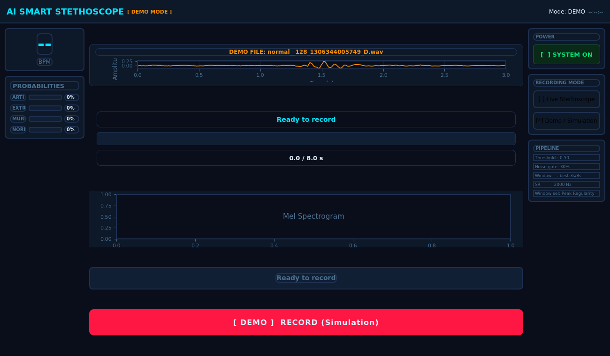

<div align="center">

# 🩺 Smart Stethoscope
### AI-Assisted Heart Sound Screening on Raspberry Pi
### سماعة طبية ذكية تعمل بالذكاء الاصطناعي لفحص صوت القلب على Raspberry Pi

[](https://python.org)
[](https://www.tensorflow.org/lite)
[](https://doc.qt.io/qtforpython/)
[](https://www.raspberrypi.com/)
[](LICENSE)
[](https://github.com/eahmeddarwish/smart-stethoscope)

**Kuwait College of Science & Technology -- Group 07 Capstone Project**
**Built by [Ahmed Darwish](mailto:eahmeddarwish@gmail.com)**

[📷 Screenshots](#-demo--عرض-توضيحي) · [📖 Model Card](docs/MODEL_CARD.md) · [🩹 Dataset Fix](docs/DATASET_LABEL_FIX.md) · [⭐ Star on GitHub](https://github.com/eahmeddarwish/smart-stethoscope)

</div>

---

## 🌍 Overview | نظرة عامة

**[English]**
Smart Stethoscope is a low-cost, Raspberry Pi-based digital stethoscope
that uses a quantized CNN to screen heart sounds for **murmurs**, **extra
heart sounds (S3/S4)**, and **recording artifacts**, in addition to
flagging **normal** sounds. It runs entirely on-device (no cloud
inference), shows its reasoning on a touchscreen GUI, and exports a
clinical-style PDF report. The project is complete and working end to
end, and is published here as an open, improvable reference project --
not a finished commercial medical device.

**[العربية]**
"سماعة طبية ذكية" هو مشروع سماعة رقمية منخفضة التكلفة مبني على جهاز
Raspberry Pi، ويستخدم شبكة عصبية تلافيفية (CNN) مضغوطة (quantized) لفحص
صوت القلب المسجَّل وتصنيفه لواحدة من أربع حالات: **صوت طبيعي**، **طنين
أو لغط قلبي (murmur)**، **صوت قلب إضافي (S3/S4)**، أو **تشويش في
التسجيل** (جودة تسجيل غير كافية للتحليل). كل المعالجة والتحليل يحصلان
بالكامل على الجهاز نفسه من غير أي اتصال بالإنترنت أو إرسال بيانات لأي
سيرفر خارجي، والشاشة تعرض سبب القرار بالتفصيل وليس فقط النتيجة، وبعدها
يمكن تصدير تقرير PDF بأسلوب يشبه التقارير الطبية. المشروع **مكتمل وشغال
فعليًا من لحظة الالتقاط وحتى التقرير النهائي**، ومنشور هنا بشكل مفتوح
وموثّق بالكامل حتى يستطيع أي شخص -- طالب، باحث، أو مؤسسة طبية -- أن
يفهمه ويبني عليه ويطوّره. هو ليس جهاز طبي تجاري معتمد، وهذا موضّح بوضوح
في كل الوثائق المرفقة.

> **Medical disclaimer / إخلاء مسؤولية:** this is a screening aid, not a
> diagnostic device. Every result must be confirmed by a qualified
> clinician. See [`LICENSE`](LICENSE) and [`docs/MODEL_CARD.md`](docs/MODEL_CARD.md)
> for full limitations.
>
> هذه أداة **فحص أولي مساعِد (screening aid)**، وليست جهاز تشخيص طبي. أي
> نتيجة يطلعها النظام لازم تتأكد من طبيب مختص قبل أي قرار طبي. راجع
> [`LICENSE`](LICENSE) و[`docs/MODEL_CARD.md`](docs/MODEL_CARD.md) لكل
> حدود الاستخدام.

---

## 🩺 What the App Actually Produces | إيه اللي بيطلعه النظام فعليًا

**[English]**
For every recording -- a live microphone capture, or an archived file in
demo mode -- the pipeline generates five distinct outputs, not just a
single label:

1. **A classification** into one of four classes -- `normal`, `murmur`,
   `extrahls` (extra heart sound), `artifact` -- together with the full
   per-class confidence breakdown (all four probabilities, not just the
   winning one).
2. **A clinical findings list**: short, specific acoustic observations
   (e.g. *"triple rhythm (gallop) pattern identified in waveform"*) that
   explain what the model actually detected in the signal.
3. **A written clinical-reasoning paragraph**: a plain-language
   explanation of *why* the model reached that particular call, including
   the murmur-probability score and how it compares against the decision
   threshold.
4. **A plain-language recommendation**: e.g. *"cardiology referral
   strongly advised; transthoracic echocardiogram recommended"* -- so a
   non-specialist operator immediately knows what to do next.
5. **A downloadable, printable PDF diagnosis report** (generated with
   ReportLab) that bundles all of the above plus four signal plots: the
   full raw-vs-filtered waveform, the exact 3-second window the model
   actually analyzed, its Mel-spectrogram, and a frequency-domain view
   that highlights the normal S1/S2 band against the murmur band. A real,
   code-generated sample is shown below in [Demo](#-demo--عرض-توضيحي).

**[العربية]**
لكل تسجيل -- سواء من الميكروفون مباشرة، أو ملف من الداتاسيت في وضع
"Demo" -- ينتج خط المعالجة **خمسة مخرجات منفصلة، مش مجرد تصنيف واحد**:

1. **تصنيف** لواحدة من أربع فئات -- طبيعي (`normal`)، طنين قلبي
   (`murmur`)، صوت قلب إضافي (`extrahls`)، أو تشويش (`artifact`) -- مع
   نسبة الثقة الكاملة لكل فئة على حدة (الأربع نسب مع بعض، مش بس الفئة
   الفايزة).
2. **قائمة ملاحظات إكلينيكية (Clinical Findings)**: ملاحظات صوتية محددة
   وقصيرة (مثلاً *"تم رصد نمط إيقاع ثلاثي (Gallop) في الموجة"*) توضّح
   بالضبط إيه اللي "لاحظه" النموذج فعليًا في الإشارة الصوتية.
3. **فقرة "تعليل إكلينيكي" مكتوبة بالكامل**: شرح مبسّط باللغة الطبيعية
   لسبب وصول النموذج للقرار ده تحديدًا، بما في ذلك نسبة احتمالية الطنين
   ومقارنتها بعتبة القرار (threshold) المستخدمة.
4. **توصية عملية واضحة**: مثلاً *"يُنصح بالتحويل لطبيب قلب، ويُنصح بعمل
   إيكو قلب (Echocardiogram)"* -- عشان أي شخص بيشغّل الجهاز، حتى لو مش
   متخصص طبيًا، يعرف الخطوة التالية فورًا.
5. **تقرير PDF كامل قابل للتحميل والطباعة** (مُولَّد بمكتبة ReportLab)
   يجمع كل اللي فوق، بالإضافة لأربع رسومات بيانية: الموجة الخام مقابل
   المفلترة بالكامل، نافذة الـ3 ثواني اللي فعليًا حللها النموذج، طيف Mel
   الخاص بها، وتحليل ترددي يوضّح نطاق صوتي S1/S2 الطبيعي مقابل نطاق
   الطنين. نموذج حقيقي اتولّد من نفس الكود موجود تحت في قسم [العرض
   التوضيحي](#-demo--عرض-توضيحي).

---

## 🩹 We Found and Fixed a Real Bug in the Public Training Dataset | لاقينا وصلّحنا خطأ حقيقي في داتاسيت التدريب العام

**[English]**
While preparing this project for release, we discovered that the
official label files (`set_a.csv`, `set_b.csv`) shipped with the
widely-used Kaggle mirror of the PASCAL "Classifying Heart Sounds"
dataset **do not reliably match the actual audio filenames on disk** --
a systematic filename-prefix and underscore-convention corruption
affecting a large share of `set_a` and the majority of `set_b`. If you
join these CSVs to the real `.wav` files by filename (the obvious thing
to do), a large fraction of `set_b` rows simply fail to match, and a
smaller but nonzero fraction of `set_a` rows silently match nothing --
so a naive pipeline either crashes or, worse, silently drops labeled
training examples without anyone noticing.

We reverse-engineered the exact corruption pattern (phantom prefixes,
inconsistent single- vs. double-underscore conventions between "plain"
and "noisy" recording variants, and colliding numeric IDs between
labeled and unlabeled files) and rebuilt a corrected `fname -> label`
mapping for **all 832 recordings**: **176/176 in `set_a`** and
**656/656 in `set_b`** -- **100% resolved, zero orphan files** --
verified programmatically against the real files on disk. The full
methodology, worked before/after examples, and how to reproduce or use
the fix are documented in
[**`docs/DATASET_LABEL_FIX.md`**](docs/DATASET_LABEL_FIX.md).

**[العربية]**
أثناء تجهيز هذا المشروع للنشر، اكتشفنا إن ملفات التسميات الرسمية
(`set_a.csv` و`set_b.csv`) المرفقة مع نسخة Kaggle الشهيرة من داتاسيت
"Heartbeat Sounds" (المبني أصلًا على تحدي PASCAL) **فيها خطأ منهجي في
مطابقة أسماء الملفات مع الملفات الصوتية الفعلية على القرص** -- بادئات
وهمية وعدم اتساق في استخدام الخط تحت السفلي، بيأثر على جزء كبير من
`set_a` وعلى أغلب صفوف `set_b`. لو حاولت تربط ملفات الـCSV دي بملفات
`.wav` الحقيقية بالاسم (وهو الشيء البديهي اللي أي حد هيعمله)، جزء كبير
من صفوف `set_b` هيفشل في المطابقة تمامًا، وجزء أصغر لكنه موجود فعليًا من
صفوف `set_a` هيطابق ملفات غلط من غير ما حد يلاحظ -- يعني أي خط معالجة
بسيط إما هيتعطل، أو الأسوأ، هيفقد أمثلة تدريب مُصنَّفة بصمت تام.

رجعنا للنمط الدقيق للخطأ (بادئات وهمية، عدم اتساق بين استخدام خط تحت
سفلي واحد أو اتنين بين النسخة "العادية" ونسخة "الضوضاء noisy" من نفس
التسجيل، وتضارب في بعض الأرقام التسلسلية بين ملفات مُصنَّفة وملفات بدون
تصنيف) وبنينا خريطة تصحيح كاملة (`fname -> label`) لـ**كل الـ832 تسجيل**:
**176 من أصل 176 في `set_a`** و**656 من أصل 656 في `set_b`** -- **تصحيح
100%، صفر ملفات بدون مرجع** -- وتأكدنا برمجيًا إن كل صف بيشاور فعلاً على
الملف الصحيح على القرص. المنهجية الكاملة، أمثلة قبل/بعد موضّحة خطوة
بخطوة، وطريقة استخدام أو إعادة إنتاج التصحيح كلها موثقة في
[**`docs/DATASET_LABEL_FIX.md`**](docs/DATASET_LABEL_FIX.md).

**Original / source dataset links | روابط الداتاسيت الأصلي:**

| Source / المصدر | Link / الرابط |
|---|---|
| Kaggle mirror (the CSVs/audio this project builds on) / نسخة Kaggle (اللي المشروع مبني عليها) | https://www.kaggle.com/datasets/kinguistics/heartbeat-sounds |
| Original PASCAL "Classifying Heart Sounds Challenge" (2011/2012) / تحدي PASCAL الأصلي | https://www.peterjbentley.com/heartchallenge/ |

**[English]** We are **not** redistributing the audio itself -- only the
corrected filename/label mapping (`data/set_a_fixed.csv`,
`data/set_b_fixed.csv`). Download the dataset from the links above and
join it against our fixed CSVs instead of the original Kaggle ones.

**[العربية]** **مش بننشر أي ملفات صوت** -- بس خريطة التصحيح (أسماء
ملفات + تصنيفات فقط). نزّل الداتاسيت من الروابط اللي فوق واستخدمه مع
ملفاتنا المصححة بدل ملفات Kaggle الأصلية.

---

## ✨ Key Features | المميزات

| Feature | Details |
|---|---|
| 🧠 **On-device CNN** | Mel-spectrogram -> quantized (INT8) TFLite CNN, 9+ training iterations |
| 🩺 **4-class screening** | normal / murmur / extrahls (S3-S4) / artifact, with a murmur-first safety threshold |
| 🎯 **100% murmur recall** (validation) | Threshold tuned so a real murmur is never silently missed -- see [Model Card](docs/MODEL_CARD.md) for the precision tradeoff this implies |
| 🖥️ **Touchscreen GUI** | PySide6, 800x480, live mic capture or demo/simulation mode, waveform + Mel-spectrogram + clinical reasoning panel |
| 📄 **PDF diagnosis report** | Auto-generated, dark clinical theme, waveform/spectrogram/frequency plots, per-class probabilities, findings + reasoning + recommendation |
| 🔌 **Config-driven paths** | No more hardcoded `/home/pi/...` -- override with `STETHOSCOPE_BASE_DIR` and friends |
| 🧪 **Unit-tested DSP core** | The signal pipeline (filters, windowing, features) is pure Python/NumPy, testable with no Qt/hardware needed |
| 🩹 **Public dataset fix** | Found and corrected a filename/label corruption bug in the training dataset's CSVs -- see [`docs/DATASET_LABEL_FIX.md`](docs/DATASET_LABEL_FIX.md) |

**بالعربية:**

| الميزة | التفاصيل |
|---|---|
| 🧠 **شبكة عصبية على الجهاز نفسه** | تحويل الصوت لطيف Mel، ثم شبكة CNN مضغوطة (INT8) عبر TFLite، بعد أكتر من 9 محاولات تدريب مختلفة |
| 🩺 **تصنيف رباعي** | طبيعي / طنين / صوت إضافي (S3-S4) / تشويش، مع قاعدة أمان "الطنين أولًا" في اتخاذ القرار |
| 🎯 **استرجاع (recall) 100% للطنين** على مجموعة التحقق | العتبة مضبوطة عشان أي طنين حقيقي ميتفوتش أبدًا -- شوف [Model Card](docs/MODEL_CARD.md) لتوضيح الأثر على الدقة الكلية |
| 🖥️ **واجهة شاشة لمس** | PySide6، بدقة 800x480، تسجيل مباشر من الميكروفون أو وضع تجريبي (Demo)، مع عرض الموجة والطيف والتعليل الإكلينيكي |
| 📄 **تقرير PDF تشخيصي** | يتولد تلقائيًا بتصميم داكن يشبه التقارير الطبية، فيه الرسومات البيانية ونسب كل فئة والملاحظات والتعليل والتوصية |
| 🔌 **مسارات قابلة للتهيئة** | من غير مسارات مكتوبة يدويًا زي `/home/pi/...`، تتحكم فيها بمتغير البيئة `STETHOSCOPE_BASE_DIR` |
| 🧪 **معالجة إشارة مُختبَرة** | خط معالجة الإشارة (فلاتر، اختيار أفضل نافذة، استخلاص الخصائص) بايثون/NumPy خالص، قابل للاختبار من غير أي عتاد أو واجهة رسومية |
| 🩹 **تصحيح علني لخطأ في الداتاسيت** | اكتشفنا وصلّحنا خطأ في تسميات ملفات التدريب -- التفاصيل في [`docs/DATASET_LABEL_FIX.md`](docs/DATASET_LABEL_FIX.md) |

---

## 📷 Demo | عرض توضيحي

<div align="center">


<br/><br/>


</div>

**[English]**
Top-left: the **main interface** (`LiveScreen`) -- BPM box, per-class
probability bars, the demo/live mode switch, pipeline settings
(threshold, noise gate, window size), and the big RECORD button.
Top-right: the **diagnosis report screen** (`ResultScreen`) after
analysis -- result banner, the enhanced waveform and Mel-spectrogram of
the exact window the model saw, and the clinical reasoning text.
Bottom-left: **page 1 of the exported PDF report** -- the same result in
printable, shareable form, with class-probability bars, clinical
findings, and the recommendation. Bottom-right: the physical hardware.

📄 **[Open the full 3-page sample PDF report](assets/sample_report.pdf)**
-- patient/session info, class-probability bars, clinical findings, the
full reasoning paragraph, the recommendation, and four signal plots
(raw/filtered waveform, the model's actual input window, its
Mel-spectrogram, and a frequency-domain view).

Every image above, and the sample PDF, were generated **directly from
this repository's current code** (see
[`scripts/generate_demo_assets.py`](scripts/generate_demo_assets.py)),
run offscreen against a real archived recording
(`normal__128_1306344005749_D.wav`, `set_b`). The trained `.tflite`
model file itself lives only on the project's Raspberry Pi hardware and
is not part of this repo (see
[Quick Start](#-quick-start--البدء-السريع)), so the classification
numbers shown reproduce a previously-observed real result for this exact
recording rather than a brand-new inference run -- but every plot,
waveform, spectrogram, BPM estimate, and PDF layout is produced by the
real, current pipeline code, not mocked or hand-drawn.

To try the GUI yourself without a stethoscope attached, run it in **Demo
mode**, which plays back a recording from the training dataset through
the exact same pipeline used for a live capture (clearly labeled
`[ DEMO MODE ]` on screen and in the exported PDF, so a demo run can
never be mistaken for a real patient reading).

**[العربية]**
أعلى اليسار: **الواجهة الرئيسية** (`LiveScreen`) -- مربع معدل النبض
(BPM)، أشرطة احتمالية كل فئة، مفتاح التبديل بين وضع Demo والوضع
المباشر، إعدادات خط المعالجة (العتبة، بوابة الضوضاء، حجم النافذة)، وزر
التسجيل الكبير. أعلى اليمين: **شاشة تقرير التشخيص** (`ResultScreen`)
بعد التحليل -- شريط النتيجة، الموجة المحسّنة وطيف Mel لنفس النافذة اللي
حللها النموذج فعليًا، ونص التعليل الإكلينيكي. أسفل اليسار: **الصفحة
الأولى من تقرير الـPDF المُصدَّر** -- نفس النتيجة بصيغة قابلة للطباعة
والمشاركة، مع أشرطة احتمالية كل فئة والملاحظات الإكلينيكية والتوصية.
أسفل اليمين: صورة العتاد الفعلي.

📄 **[افتح تقرير الـPDF التجريبي الكامل (3 صفحات)](assets/sample_report.pdf)**
-- معلومات المريض/الجلسة، أشرطة احتمالية كل فئة، الملاحظات الإكلينيكية،
فقرة التعليل الكاملة، التوصية، وأربع رسومات بيانية (الموجة الخام
والمفلترة، نافذة الإدخال الفعلية للنموذج، طيف Mel الخاص بها، وتحليل
ترددي).

كل صورة فوق، وكمان تقرير الـPDF التجريبي، **اتولدوا مباشرة من كود هذا
المستودع الحالي** (شوف
[`scripts/generate_demo_assets.py`](scripts/generate_demo_assets.py))،
اتشغلوا بدون شاشة (offscreen) على تسجيل حقيقي من الداتاسيت
(`normal__128_1306344005749_D.wav`، `set_b`). ملف النموذج المدرَّب
(`.tflite`) نفسه موجود بس على عتاد Raspberry Pi الخاص بالمشروع ومش جزء
من هذا المستودع (شوف [البدء السريع](#-quick-start--البدء-السريع))، فالأرقام
اللي ظاهرة في التصنيف بتعيد نتيجة حقيقية اتلاحظت سابقًا لنفس التسجيل ده
بالضبط، مش تشغيل استدلال جديد تمامًا -- لكن كل رسم بياني وموجة وطيف
وتقدير نبض وتصميم تقرير PDF نتج فعليًا من كود خط المعالجة الحالي
الحقيقي، مش مُلفَّق أو مرسوم يدويًا.

عشان تجرّب الواجهة بنفسك من غير سماعة موصولة، شغّلها في **وضع Demo**،
اللي بيشغّل تسجيل من الداتاسيت عبر نفس خط المعالجة المستخدم في التسجيل
المباشر (وبيتحدد بوضوح `[ DEMO MODE ]` على الشاشة وفي تقرير الـPDF، عشان
تشغيلة تجريبية متتلخبطش أبدًا مع قراءة مريض حقيقي).

---

## 🏗️ Architecture | معمارية المشروع

```
smart-stethoscope/
├── src/smart_stethoscope/
│   ├── config.py            <- env-driven paths & audio settings (no hardcoded /home/pi)
│   ├── signal_pipeline.py   <- pure DSP: filters, best-window selection, Mel features
│   ├── clinical_info.py     <- per-class explanation/recommendation text
│   ├── inference.py         <- TFLite loading (ai_edge_litert/tflite_runtime/tensorflow) + murmur-first rule
│   ├── audio_capture.py     <- microphone recording + demo-dataset playback
│   ├── report.py            <- PDF diagnosis report (ReportLab)
│   └── gui/                 <- PySide6 touchscreen app (theme, widgets, screens, app)
├── scripts/                 <- standalone hardware bring-up / R&D tools (mic test, filter comparison, threshold sweep, demo-asset generator)
├── tests/                   <- pytest unit tests for the DSP pipeline (no hardware/model required)
├── data/                    <- corrected dataset label CSVs (no audio -- see Dataset Fix)
├── docs/                    <- MODEL_CARD.md, DATASET_CARD.md, DATASET_LABEL_FIX.md
└── .github/workflows/ci.yml <- lint (ruff) + pytest on every push
```

**[English]**
The codebase is split so it's easy to understand and extend: every bit
of signal-processing logic (`signal_pipeline.py`), every bit of
inference logic (`inference.py`), and every bit of clinical explanation
text (`clinical_info.py`) is fully decoupled from the GUI code (`gui/`)
-- meaning you can exercise the entire pipeline from plain Python or a
Jupyter notebook without ever opening the touchscreen app or plugging in
any hardware. `data/` holds the dataset correction files (no audio);
`docs/` holds all the medical and technical documentation (Model Card,
Dataset Card, and the dataset bug-fix write-up).

**[العربية]**
بنية الكود مقسّمة بشكل يسهّل فهمها والتطوير عليها: كل منطق معالجة
الإشارة (`signal_pipeline.py`)، وكل منطق الاستدلال (`inference.py`)،
وكل نصوص الشرح الإكلينيكي (`clinical_info.py`) منفصلين تمامًا عن كود
الواجهة الرسومية (`gui/`) -- يعني تقدر تختبر وتشغّل خط المعالجة الكامل
من كود بايثون عادي أو من دفتر Jupyter من غير ما تحتاج تفتح الواجهة أو
توصل أي عتاد أصلًا. مجلد `data/` فيه ملفات تصحيح الداتاسيت (بدون صوت)،
ومجلد `docs/` فيه كل التوثيق الطبي والتقني (بطاقة النموذج Model Card،
بطاقة الداتاسيت Dataset Card، وتفاصيل تصحيح خطأ الداتاسيت).

### Audio Pipeline | خط معالجة الإشارة الصوتية

```
Mic capture @ 44100 Hz (8s)
        |
        v
Downsample to 2000 Hz
        |
        v
Bandpass 20-950 Hz + 50 Hz notch
        |
        v
Noise gate (drop low-energy frames)
        |
        v
Best 3s window (peak-regularity score, not just loudest)
        |
        v
Mel-spectrogram (64 bands, FFT 512, hop 128)
        |
        v
INT8 TFLite CNN -> [normal, murmur, extrahls, artifact]
        |
        v
Murmur-first threshold rule -> clinical explanation + PDF report
```

**[English]**
Recording is captured from the microphone at 44100 Hz for 8 seconds,
then downsampled to 2000 Hz, then passed through a bandpass filter
(20-950 Hz) plus a mains-hum notch filter (50 Hz). A "noise gate" then
zeroes out low-energy segments, followed by a "best-window" selection
algorithm that picks the most regular 3-second slice of heartbeat --
not the loudest slice, but the one with the most regular peak-interval
pattern, so a cough or the stethoscope rubbing against skin doesn't get
mistaken for "the interesting part." The result is converted to a
Mel-spectrogram (64 bands, FFT size 512, hop length 128) and fed into
the quantized (INT8) CNN, which returns a probability for each of the
four classes. Finally, the murmur-first decision rule is applied to pick
the final class, and the clinical explanation and PDF report are
generated from that.

**[العربية]**
التسجيل يُلتقط من الميكروفون بمعدل عينات 44100 هرتز لمدة 8 ثواني،
بعدين يتخفّض المعدل لـ2000 هرتز، ويعدّي على فلتر تمريري نطاقي (20-950
هرتز) بالإضافة لفلتر إزالة تشويش الكهرباء (50 هرتز). بعد كده "بوابة
ضوضاء" (Noise Gate) بتصفر الأجزاء منخفضة الطاقة، ثم خوارزمية اختيار
"أفضل نافذة" بطول 3 ثواني -- مش أعلى نافذة صوتًا، لكن أكتر نافذة فيها
نمط نبض قلب منتظم من ناحية المسافات بين النبضات، عشان سعال أو احتكاك
السماعة بالجلد ميتحسبش غلط على إنه "الجزء المهم" من التسجيل. الناتج
يتحول لطيف Mel (64 نطاق، حجم FFT يساوي 512، وخطوة قدرها 128)، وده اللي
بيتغذى للشبكة العصبية المضغوطة (INT8)، اللي بترجع احتمال كل فئة من
الأربعة. أخيرًا، تتطبّق قاعدة "الطنين أولًا" لاختيار الفئة النهائية،
ومن عليها يتولد الشرح الإكلينيكي وتقرير الـPDF.

**[English]** Full rationale for the murmur-first decision rule, the
threshold-sweep result, and known failure modes are documented in
[`docs/MODEL_CARD.md`](docs/MODEL_CARD.md).

**[العربية]** التبرير الكامل لقاعدة "الطنين أولًا"، ونتيجة ضبط العتبة،
وأنماط الفشل المعروفة، كلها موثقة في
[`docs/MODEL_CARD.md`](docs/MODEL_CARD.md).

---

## 🚀 Quick Start | البدء السريع

### 1. Install | التثبيت

```bash
git clone https://github.com/eahmeddarwish/smart-stethoscope.git
cd smart-stethoscope
pip install -r requirements.txt
pip install -e .          # installs the `smart-stethoscope-gui` command
```

**[العربية]** نزّل المستودع، ادخل مجلده، ثبّت المتطلبات، ثم ثبّت الحزمة
نفسها بوضع قابل للتعديل (`-e`) -- الأمر الأخير هو اللي بيضيف أمر
`smart-stethoscope-gui` لتشغيل الواجهة.

### 2. Get the Model | الحصول على النموذج المدرَّب

**[English]** The trained model files are not stored in this git
repository (see `.gitignore`). Place them at:

```
$STETHOSCOPE_BASE_DIR/models/heart_model_v9_int8.tflite
$STETHOSCOPE_BASE_DIR/models/heart_label_encoder_v9.pkl
$STETHOSCOPE_BASE_DIR/models/heart_config_v9.pkl   # optional, overrides pipeline defaults
```

`STETHOSCOPE_BASE_DIR` defaults to `~/Smart_Stethoscope` and can be
overridden, e.g. `export STETHOSCOPE_BASE_DIR=/home/pi/Desktop/Smart_Stethoscope`
to match the original Raspberry Pi deployment layout.

**[العربية]** ملفات النموذج المدرَّب مش مخزنة في هذا المستودع (شوف
`.gitignore`) -- لسه موجودة فقط على عتاد Raspberry Pi الأصلي للمشروع.
حطها في المسارات اللي فوق. متغير البيئة `STETHOSCOPE_BASE_DIR` قيمته
الافتراضية `~/Smart_Stethoscope`، وتقدر تغيّره، مثلًا
`export STETHOSCOPE_BASE_DIR=/home/pi/Desktop/Smart_Stethoscope` عشان
يطابق شكل النشر الأصلي على الـRaspberry Pi.

### 3. Get the Dataset (only needed for demo mode or retraining) | الحصول على الداتاسيت (بس لو هتستخدم وضع Demo أو تعيد التدريب)

**[English]** Download the ["Heartbeat Sounds" dataset](https://www.kaggle.com/datasets/kinguistics/heartbeat-sounds)
from Kaggle (originally from the [PASCAL Classifying Heart Sounds Challenge](https://www.peterjbentley.com/heartchallenge/))
and place it at `$STETHOSCOPE_BASE_DIR/datasets/Heartbeats/{set_a,set_b}/`.
**Use `data/set_a_fixed.csv` / `data/set_b_fixed.csv` from this repo
instead of the original Kaggle CSVs** -- see
[`docs/DATASET_LABEL_FIX.md`](docs/DATASET_LABEL_FIX.md) for why.

**[العربية]** نزّل داتاسيت ["Heartbeat Sounds"](https://www.kaggle.com/datasets/kinguistics/heartbeat-sounds)
من Kaggle (الأصل من [تحدي PASCAL](https://www.peterjbentley.com/heartchallenge/))
وحطه في المسار `$STETHOSCOPE_BASE_DIR/datasets/Heartbeats/{set_a,set_b}/`.
**استخدم ملفات `data/set_a_fixed.csv` / `data/set_b_fixed.csv` بتاعة هذا
المستودع بدل ملفات Kaggle الأصلية** -- الأسباب موضحة في
[`docs/DATASET_LABEL_FIX.md`](docs/DATASET_LABEL_FIX.md).

### 4. Run | التشغيل

```bash
smart-stethoscope-gui
```

### 5. Run the Tests (no hardware or model file needed) | تشغيل الاختبارات (بدون عتاد أو ملف نموذج)

```bash
pytest tests/
```

**[العربية]** الاختبارات دي بتغطي خط معالجة الإشارة (الفلاتر، اختيار
النافذة، استخراج الخصائص) وحدها -- مش محتاجة عتاد ولا ملف نموذج مدرَّب،
عشان تقدر تتأكد إن الكود شغال صح حتى من غير Raspberry Pi.

### 6. Regenerate the Demo Assets (optional) | إعادة توليد صور العرض التوضيحي (اختياري)

```bash
python scripts/generate_demo_assets.py
```

**[English]** Renders the GUI screens offscreen and generates a sample
PDF report from a real archived recording -- used to produce the
screenshots and PDF linked in [Demo](#-demo--عرض-توضيحي) above. Requires
the dataset (step 3); does not require the trained model.

**[العربية]** بيرسم شاشات الواجهة من غير شاشة فعلية (offscreen) ويولّد
تقرير PDF تجريبي من تسجيل حقيقي من الداتاسيت -- ده اللي استُخدم لتوليد
الصور والـPDF الموجودين في قسم [العرض التوضيحي](#-demo--عرض-توضيحي)
فوق. يحتاج الداتاسيت (الخطوة 3)؛ لا يحتاج النموذج المدرَّب.

---

## 🔧 Hardware | العتاد

| Component | Notes |
|---|---|
| Raspberry Pi | Runs the GUI + on-device inference |
| BOYA BY-M1 Pro lavalier mic | Connected via a USB audio adapter (EA2) |
| Stethoscope chest piece | Acoustically coupled to the mic capsule |
| Touchscreen, 800x480 | GUI is laid out for this resolution |

**بالعربية:**

| المكوّن | ملاحظات |
|---|---|
| Raspberry Pi | يشغّل الواجهة والاستدلال على الجهاز نفسه |
| ميكروفون لافالير BOYA BY-M1 Pro | متوصل عبر محول صوت USB باسم EA2 |
| رأس السماعة الطبية | متصل صوتيًا بكبسولة الميكروفون |
| شاشة لمس بدقة 800x480 | الواجهة الرسومية مصممة خصيصًا لهذه الدقة |

**[English]** See the full hardware design, wiring, and requirements
(functional + financial, ~60 KWD BOM) in the original capstone report,
`AI-based Smart Digital Stethoscope for Medical Diagnosis.pdf` (KCST
Group 07, first-semester deliverable).

**[العربية]** التصميم الكامل للعتاد والتوصيلات والمتطلبات الوظيفية
والمالية (تكلفة إجمالية تقريبية 60 دينار كويتي) موجودة في تقرير المشروع
الأصلي `AI-based Smart Digital Stethoscope for Medical Diagnosis.pdf`
(تسليم الفصل الدراسي الأول، مجموعة 07 -- KCST).

---

## 📊 Reported Results | النتائج المُبلَّغ عنها

| Metric | Value | Context |
|---|---|---|
| Murmur recall | 100% | Validation set, after threshold sweep (not a held-out test set -- see caveat below) |
| Overall accuracy | 75% | Same set; deliberately traded off against murmur recall |

**بالعربية:**

| المقياس | القيمة | السياق |
|---|---|---|
| استرجاع الطنين (Murmur recall) | 100% | على مجموعة التحقق (validation)، بعد ضبط العتبة (مش مجموعة اختبار منفصلة -- شوف التحفظ تحت) |
| الدقة الكلية | 75% | نفس المجموعة؛ اتضحّى بها عمدًا مقابل استرجاع الطنين |

> **Read the caveat, not just the numbers.** These figures come from a
> threshold sweep on the *validation* set used to pick the operating
> point -- there is no independently reported held-out *test* set result.
> Adding one is the top item on the roadmap below. Treat the 100%/75%
> pair as "this is what the current threshold optimizes for," not as a
> claim of clinical-grade accuracy.
>
> **اقرأ التحفظ مش بس الأرقام.** الأرقام دي طالعة من ضبط العتبة (threshold
> sweep) على مجموعة **التحقق (validation)** نفسها اللي استُخدمت لاختيار
> نقطة التشغيل -- مفيش نتيجة مُبلَّغ عنها بشكل مستقل على مجموعة **اختبار
> (test)** منفصلة تمامًا. إضافة مجموعة اختبار حقيقية هي أول بند في خطة
> التطوير تحت. اعتبر رقمي 100%/75% على إنهم "ده اللي العتبة الحالية
> بتحسّنه"، مش ادّعاء بدقة على مستوى إكلينيكي معتمد.

---

## 🗺️ Roadmap | خطط التطوير

| Phase | English | العربية |
|---|---|---|
| ✅ Phase 1 | Working end-to-end pipeline: capture, DSP, CNN, GUI, PDF report *(current)* | خط معالجة كامل شغال: التقاط، معالجة إشارة، شبكة عصبية، واجهة، تقرير PDF *(الحالي)* |
| ✅ Phase 2 | Codebase restructured into a testable package, CI, model/dataset cards, dataset label-fix published | إعادة هيكلة الكود لحزمة قابلة للاختبار، مع CI، وبطاقات النموذج والداتاسيت، ونشر تصحيح الداتاسيت |
| ⬜ Phase 3 | Held-out test-set evaluation (separate from the threshold-selection validation set) + confusion matrix in `MODEL_CARD.md` | تقييم على مجموعة اختبار منفصلة تمامًا عن مجموعة ضبط العتبة + مصفوفة ارتباك في `MODEL_CARD.md` |
| ⬜ Phase 4 | Screen-recorded video demo + real-patient live-mic validation session (currently gated by hardware access, not code) | فيديو تسجيل شاشة + جلسة تحقق حقيقية بميكروفون مباشر على مريض حقيقي (معطّلة حاليًا بسبب توفر العتاد وليس الكود) |
| ⬜ Phase 5 | Bluetooth output speaker for clinician playback; packaged Raspberry Pi OS image for one-flash setup | سماعة بلوتوث لتشغيل الصوت للطبيب المراجِع؛ نسخة نظام تشغيل Raspberry Pi جاهزة للتثبيت بضغطة واحدة |

---

## ⚠️ Disclaimer | إخلاء المسؤولية

> **This project is for educational and research purposes only.** It is
> not a certified medical device and has not been cleared by any
> regulatory authority. Predictions must be confirmed by a qualified
> clinician before any clinical decision is made.
>
> **هذا المشروع لأغراض تعليمية وبحثية فقط.** مش جهاز طبي معتمد من أي جهة
> تنظيمية، ولازم أي نتيجة يطلعها النظام تتأكد من طبيب مختص قبل أي قرار
> طبي، مهما بدت النتيجة واضحة أو مؤكدة.

---

## 👤 Author | المطور

<div align="center">

**Ahmed Darwish**

*Electrical & Computer Engineer | Python · Arduino · Raspberry Pi · AI/ML*

[](mailto:eahmeddarwish@gmail.com)
[](https://github.com/eahmeddarwish)

</div>

**Kuwait College of Science & Technology, Group 07** -- capstone project team. / **الكلية الكويتية للعلوم والتكنولوجيا، المجموعة 07** -- فريق مشروع التخرج.

---

## 📄 License | الترخيص

MIT License (with an explicit medical-disclaimer addendum) -- see
[`LICENSE`](LICENSE). / رخصة MIT (مع إضافة صريحة لإخلاء مسؤولية طبي) --
شوف [`LICENSE`](LICENSE).

---

<div align="center">

⭐ **If this project helped you, please give it a star on GitHub!** ⭐
⭐ **لو المشروع أفادك، متنساش تدّيله نجمة على GitHub!** ⭐

*Made with ❤️ by Ahmed Darwish -- Kuwait College of Science & Technology, Group 07*

</div>
