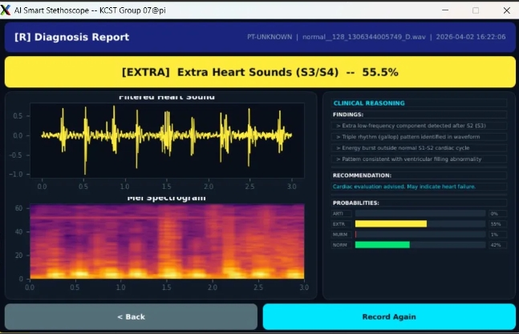
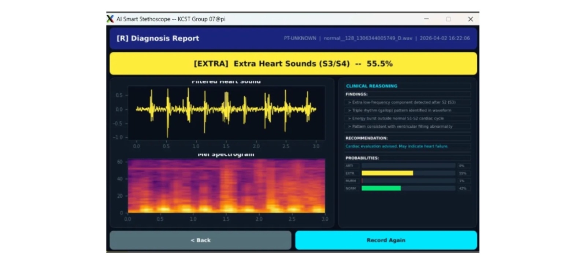

<div align="center">

# 🩺 Smart Stethoscope

### AI-Assisted Heart Sound Screening on Raspberry Pi

[](https://python.org)
[](https://www.tensorflow.org/lite)
[](https://doc.qt.io/qtforpython/)
[](https://www.raspberrypi.com/)
[](LICENSE)
[](https://github.com/eahmeddarwish/smart-stethoscope)

**Kuwait College of Science & Technology -- Group 07 Capstone Project**
**Built by [Ahmed Darwish](mailto:eahmeddarwish@gmail.com)**

[📷 Screenshots](#-demo) · [📖 Model Card](docs/MODEL_CARD.md) · [🩹 Dataset Fix](docs/DATASET_LABEL_FIX.md) · [⭐ Star on GitHub](https://github.com/eahmeddarwish/smart-stethoscope)

</div>

---

## 🌍 Overview | نظرة عامة

**[English]**
Smart Stethoscope is a low-cost, Raspberry Pi-based digital stethoscope
that uses a quantized CNN to screen heart sounds for **murmurs**, **extra
heart sounds (S3/S4)**, and **recording artifacts**, in addition to
flagging **normal** sounds. It runs entirely on-device (no cloud
inference), shows its reasoning on a touchscreen GUI, and exports a
clinical-style PDF report. The project is complete and working end to
end, and is published here as an open, improvable reference project --
not a finished commercial medical device.

**[العربية]**
سماعة طبية ذكية منخفضة التكلفة مبنية على Raspberry Pi، بتستخدم شبكة عصبية
مضغوطة (CNN) لفحص صوت القلب وتصنيفه: طبيعي، طنين (murmur)، صوت قلب إضافي
(S3/S4)، أو تشويش في التسجيل. التشغيل بالكامل على الجهاز نفسه من غير
اتصال بالإنترنت، مع شاشة تعرض سبب القرار، وتقرير PDF بأسلوب طبي. المشروع
مكتمل وشغال فعلياً، ومنشور هنا كمشروع مفتوح المصدر قابل للتطوير -- مش
جهاز طبي تجاري نهائي.

> **Medical disclaimer / إخلاء مسؤولية:** this is a screening aid, not a
> diagnostic device. Every result must be confirmed by a qualified
> clinician. See [`LICENSE`](LICENSE) and [`docs/MODEL_CARD.md`](docs/MODEL_CARD.md)
> for full limitations.

---

## ✨ Key Features | المميزات

| Feature | Details |
|---|---|
| 🧠 **On-device CNN** | Mel-spectrogram -> quantized (INT8) TFLite CNN, 9+ training iterations |
| 🩺 **4-class screening** | normal / murmur / extrahls (S3-S4) / artifact, with a murmur-first safety threshold |
| 🎯 **100% murmur recall** (validation) | Threshold tuned so a real murmur is never silently missed -- see [Model Card](docs/MODEL_CARD.md) for the precision tradeoff this implies |
| 🖥️ **Touchscreen GUI** | PySide6, 800x480, live mic capture or demo/simulation mode, waveform + Mel-spectrogram + clinical reasoning panel |
| 📄 **PDF diagnosis report** | Auto-generated, dark clinical theme, waveform/spectrogram/frequency plots, per-class probabilities |
| 🔌 **Config-driven paths** | No more hardcoded `/home/pi/...` -- override with `STETHOSCOPE_BASE_DIR` and friends |
| 🧪 **Unit-tested DSP core** | The signal pipeline (filters, windowing, features) is pure Python/NumPy, testable with no Qt/hardware needed |
| 🩹 **Public dataset fix** | Found and corrected a filename/label corruption bug in the training dataset's CSVs -- see [`docs/DATASET_LABEL_FIX.md`](docs/DATASET_LABEL_FIX.md) |

---

## 📷 Demo

<div align="center">


<br/>

</div>

The screens above are the actual GUI running on the target Raspberry Pi
hardware: the result banner (e.g. `EXTRA -- Extra Heart Sounds (S3/S4) --
55.5%`), waveform + Mel-spectrogram, per-class probability bars, and the
clinical reasoning panel. A short screen-recording demo video is on the
roadmap -- see [Roadmap](#-roadmap--خطط-التطوير) below.

To try the GUI yourself without a stethoscope attached, run it in **Demo
mode**, which plays back a random recording from the training dataset
through the exact same pipeline used for a live capture (clearly labeled
`[ DEMO MODE ]` on screen and in the exported PDF, so a demo run can never
be mistaken for a real patient reading).

---

## 🏗️ Architecture | معمارية المشروع

```
smart-stethoscope/
├── src/smart_stethoscope/
│   ├── config.py            <- env-driven paths & audio settings (no hardcoded /home/pi)
│   ├── signal_pipeline.py   <- pure DSP: filters, best-window selection, Mel features
│   ├── clinical_info.py     <- per-class explanation/recommendation text
│   ├── inference.py         <- TFLite loading (ai_edge_litert/tflite_runtime/tensorflow) + murmur-first rule
│   ├── audio_capture.py     <- microphone recording + demo-dataset playback
│   ├── report.py            <- PDF diagnosis report (ReportLab)
│   └── gui/                 <- PySide6 touchscreen app (theme, widgets, screens, app)
├── scripts/                 <- standalone hardware bring-up / R&D tools (mic test, filter comparison, threshold sweep)
├── tests/                   <- pytest unit tests for the DSP pipeline (no hardware/model required)
├── data/                    <- corrected dataset label CSVs (no audio -- see Dataset Fix)
├── docs/                    <- MODEL_CARD.md, DATASET_CARD.md, DATASET_LABEL_FIX.md
└── .github/workflows/ci.yml <- lint (ruff) + pytest on every push
```

### Audio pipeline

```
Mic capture @ 44100 Hz (8s)
        |
        v
Downsample to 2000 Hz
        |
        v
Bandpass 20-950 Hz + 50 Hz notch
        |
        v
Noise gate (drop low-energy frames)
        |
        v
Best 3s window (peak-regularity score, not just loudest)
        |
        v
Mel-spectrogram (64 bands, FFT 512, hop 128)
        |
        v
INT8 TFLite CNN -> [normal, murmur, extrahls, artifact]
        |
        v
Murmur-first threshold rule -> clinical explanation + PDF report
```

Full rationale for the murmur-first decision rule, the threshold-sweep
result, and known failure modes are documented in
[`docs/MODEL_CARD.md`](docs/MODEL_CARD.md).

---

## 🚀 Quick Start | البدء السريع

### 1. Install

```bash
git clone https://github.com/eahmeddarwish/smart-stethoscope.git
cd smart-stethoscope
pip install -r requirements.txt
pip install -e .          # installs the `smart-stethoscope-gui` command
```

### 2. Get the model

The trained model files are not stored in this git repository (see
`.gitignore`). Place them at:

```
$STETHOSCOPE_BASE_DIR/models/heart_model_v9_int8.tflite
$STETHOSCOPE_BASE_DIR/models/heart_label_encoder_v9.pkl
$STETHOSCOPE_BASE_DIR/models/heart_config_v9.pkl   # optional, overrides pipeline defaults
```

`STETHOSCOPE_BASE_DIR` defaults to `~/Smart_Stethoscope` and can be
overridden, e.g. `export STETHOSCOPE_BASE_DIR=/home/pi/Desktop/Smart_Stethoscope`
to match the original Raspberry Pi deployment layout.

### 3. Get the dataset (only needed for demo mode or retraining)

Download the ["Heartbeat Sounds" dataset](https://www.kaggle.com/datasets/kinguistics/heartbeat-sounds)
from Kaggle and place it at `$STETHOSCOPE_BASE_DIR/datasets/Heartbeats/{set_a,set_b}/`.
**Use `data/set_a_fixed.csv` / `data/set_b_fixed.csv` from this repo
instead of the original Kaggle CSVs** -- see
[`docs/DATASET_LABEL_FIX.md`](docs/DATASET_LABEL_FIX.md) for why.

### 4. Run

```bash
smart-stethoscope-gui
```

### 5. Run the tests (no hardware or model file needed)

```bash
pytest tests/
```

---

## 🔧 Hardware

| Component | Notes |
|---|---|
| Raspberry Pi | Runs the GUI + on-device inference |
| BOYA BY-M1 Pro lavalier mic | Connected via a USB audio adapter (EA2) |
| Stethoscope chest piece | Acoustically coupled to the mic capsule |
| Touchscreen, 800x480 | GUI is laid out for this resolution |

See the full hardware design, wiring, and requirements (functional +
financial, ~60 KWD BOM) in the original capstone report,
`AI-based Smart Digital Stethoscope for Medical Diagnosis.pdf` (KCST
Group 07, first-semester deliverable).

---

## 🩹 Dataset Label Fix

While preparing this project for release, we found the training
dataset's own label CSVs (`set_a.csv`, `set_b.csv`) contain a systematic
filename-corruption bug -- not something we introduced, but something we
found and fixed. Full write-up, before/after examples, and the corrected
mapping methodology: **[`docs/DATASET_LABEL_FIX.md`](docs/DATASET_LABEL_FIX.md)**.
Corrected mapping files (no audio, just filenames + labels):
`data/set_a_fixed.csv`, `data/set_b_fixed.csv`.

---

## 📊 Reported Results

| Metric | Value | Context |
|---|---|---|
| Murmur recall | 100% | Validation set, after threshold sweep (not a held-out test set -- see caveat below) |
| Overall accuracy | 75% | Same set; deliberately traded off against murmur recall |

> **Read the caveat, not just the numbers.** These figures come from a
> threshold sweep on the *validation* set used to pick the operating
> point -- there is no independently reported held-out *test* set result.
> Adding one is the top item on the roadmap below. Treat the 100%/75%
> pair as "this is what the current threshold optimizes for," not as a
> claim of clinical-grade accuracy.

---

## 🗺️ Roadmap | خطط التطوير

- [x] **Phase 1** -- Working end-to-end pipeline: capture, DSP, CNN, GUI, PDF report *(current)*
- [x] **Phase 2** -- Codebase restructured into a testable package, CI, model/dataset cards, dataset label-fix published
- [ ] **Phase 3** -- Held-out test-set evaluation (separate from the threshold-selection validation set) + confusion matrix in `MODEL_CARD.md`
- [ ] **Phase 4** -- Screen-recorded video demo + real-patient live-mic validation session (currently gated by hardware access, not code)
- [ ] **Phase 5** -- Bluetooth output speaker for clinician playback; packaged Raspberry Pi OS image for one-flash setup

---

## ⚠️ Disclaimer | إخلاء المسؤولية

> **This project is for educational and research purposes only.** It is
> not a certified medical device and has not been cleared by any
> regulatory authority. Predictions must be confirmed by a qualified
> clinician before any clinical decision is made.

> **هذا المشروع لأغراض تعليمية وبحثية فقط.** مش جهاز طبي معتمد، ولازم أي
> نتيجة تتأكد من طبيب مختص قبل أي قرار طبي.

---

## 👤 Author | المطور

<div align="center">

**Ahmed Darwish**

*Electrical & Computer Engineer | Python · Arduino · Raspberry Pi · AI/ML*

[](mailto:eahmeddarwish@gmail.com)
[](https://github.com/eahmeddarwish)

</div>

**Kuwait College of Science & Technology, Group 07** -- capstone project team.

---

## 📄 License

MIT License (with an explicit medical-disclaimer addendum) -- see
[`LICENSE`](LICENSE).

---

<div align="center">

⭐ **If this project helped you, please give it a star on GitHub!** ⭐

*Made with ❤️ by Ahmed Darwish -- Kuwait College of Science & Technology, Group 07*

</div>
